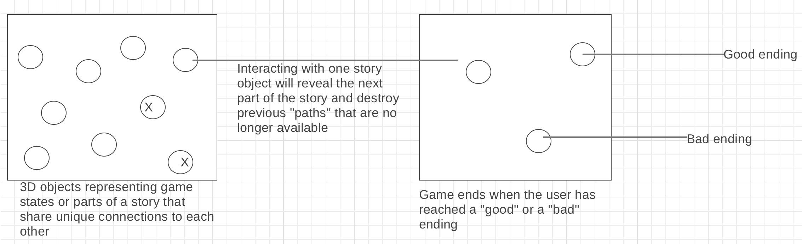

# Javascript-Project (actual project name TBD)

An interactive game where users can click on 3D objects representing parts of a fictional life story and progress through the game to reach "good" vs "bad" endings. 

## Technologies

This project will be written using three.js for rendering 3D content onto the page and vanilla JS for implementing most of the game logic. 

## Functionality and MVPs
* User will interact with the 3D objects by clicking on them 
* Each object when clicked will generate a new page with new story objects
* Game ends when the user has reached reached the end of the story     
(Bonus)  
* A score will be generated based on the user's actions that are taken throughout the game
* User will automatically lose the game if score reaches a bottom threshold 

## Wireframes 

## Implementation Timeline
June 21, 2020 - Created project repo and proposal  
June 22, 2020 - Complete three.js tutorial and create a basic moving object in additional to potentially designing some of the 3D objects that will be used  
June 23, 2020 - Continue to create the 3D objects and start implementing some game logic
